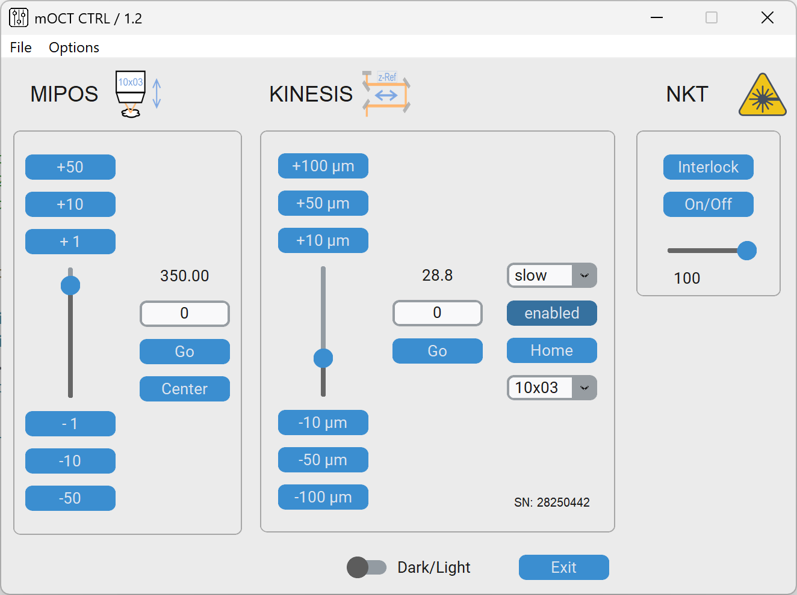

# mOCT_CTRL v1.2

Control software for the focus piezo and reference stage.

The software is hosted on Github at https://github.com/OCTSoftware/mOCT_CTRL/

## Installation

- Install **Visual Studio Code** (https://code.visualstudio.com/download)
- Install **Python 3.12** (https://www.python.org/downloads/release/python-3120/)
  - Windows installer (64-bit)
  - Check "Use admin privileges when installing py.exe"
  - Check "Add python.exe to PATH
  - Customize installation
  - Check "Install Python 3.12 for all users"
  - Check "Disable path length limit" at the end of the installation
- Download the mOCT_CTRL software from https://github.com/OCTSoftware/mOCT_CTRL/releases/tag/Release (zip file)
- Unzip files (and folders) to C:\mOCT\mOCT_CTRL

- Open Visual Studio Code
- Under Extensions (left site) enter **Python Extension Pack** and install it

- File -> Open folder ----> C:\mOCT\mOCT_CTRL
- Check "Yes trust this author" ;)
- Terminal -> New terminal
- Run "pip install -r .\requirements.txt"

- Start the **Kinesis software from Thorlabs** and check/note the serial number of the KCUBE.
- Start the **NI MAX Explorer from Ni** and view under Devices and Connections which name das the NI-USB-6001 device (e.g. Dev2).

- Select "Visual Studio Code -> Explorer" (left site) the file \_internal/config.txt and change the kcube_serial_number=28**\*\*** and the nidaq_device=Dev\*
- Select "Visual Studio Code -> Explorer" the fie **mOCT_CTRL.py**

- Click on the run button (right / top in "Visual Studio Code"

## Configuration

All settings are made in Config.txt **before** the program starts.

### Select devices

True or False

> USING_MIPOS = True \
> USING_KCUBE = True \
> USING_NKT = True

**NIDAQ board device and ports**

> NIDAQ_DEVICE = Dev<strong>**\***</strong> \
> NIDAQ_AO_PORT = ao0 \
> NIDAQ_AI_PORT = ai0

**Thorlabs KCube serial number**

> KCUBE_SN = 28<strong>**\*\*\*\*\*\***</strong>

**StepSize**

> KCUBE_STEPSIZE = 0.1

**Slider position for dedicated microscope objective lenses**

> zero = 0.0 \
> 05x16 = 10.0 \
> 10x03 = 20.0 \
> 20x05 = 30.0 \
> 40x08 = 40.0

**NKT**

> NKT_DEVICE = COM<strong>**\***</strong>

## Using the GUI

The program saves and loads automatecally the position of the reference stage and of the dedicated microscope objective lens.
The Parameter are saved in the 'config.txt' in the subfolder 'internal/'.

https://stackoverflow.com/questions/71226142/pyinstaller-with-nidaqmx
